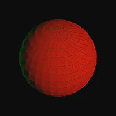
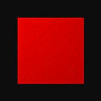
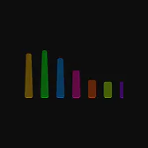

# cssGraphics

css.graphics is the asset distribution layer for
[PolyCSS](https://github.com/LayoutitStudio/polycss). It publishes curated 3D
assets as real HTML/CSS geometry, without a WebGL or canvas renderer. Each asset
ships as prepared runtime data, CSS, and images with its source, license, byte
size, and SHA-256 identity bound in one public catalog.

The current catalog includes Animated Morph Sphere, WebGL Morph Targets, and
Morph Stress Test. Every preview is generated from the same DOM/CSS model that
runs in the viewer.

<p>
  
  
  
</p>

## How to Use

Use Node.js 22.12+ and pnpm 10.33:

```sh
pnpm install --frozen-lockfile
pnpm dev
```

Open the local URL, choose an asset, and drag the model to rotate it. Press `/`
to search the catalog. The root route selects an asset, while
`?asset=<id>` creates a direct link:

```text
http://localhost:5173/?asset=animated-morph-sphere
```

Build the public site and npm package with:

```sh
pnpm typecheck
pnpm build
```

`pnpm build` uses the existing prepared public assets. It does not regenerate
source data or prepare Mario.

## How It Works

`site/public/catalog.json` is the css.graphics distribution contract. It names
every public asset and binds the exact runtime, presentation, stylesheet,
animation, image, preview, provenance, and license files that belong to it.
Vite serves and builds only that declared closure.

The viewer loads a prepared model through
[`@layoutit/polycss-morph`](https://github.com/LayoutitStudio/polycss), mounts a
stable set of PolyCSS elements, and updates their transforms and prepared morph
state. The browser does not parse upstream model formats, rebuild geometry, or
draw into a `<canvas>`.

Public assets are prepared ahead of time and tracked only when their
redistribution terms are declared in the catalog. Local Nintendo-derived
packages are a separate path and never enter the public distribution.

## Build and Runtime

The public site lives under `site/` and builds to `dist/site/`. The build copies
the 18 catalog-bound resources and rejects undeclared public files, stale byte
sizes, stale hashes, invalid media, and missing source or license metadata.

The repository also contains the unpublished `cssgraphics` npm library and CLI.
The browser API mounts prepared packages into PolyCSS:

```js
import { mountCssGraphics } from "cssgraphics";
import "cssgraphics/style.css";

const host = document.querySelector("#graphics");
if (!(host instanceof HTMLElement)) throw new Error("Missing #graphics host.");

const graphics = await mountCssGraphics(host, {
  baseUrl: "/cssgraphics/",
});

graphics.destroy();
```

The package library reads a consumer-local `/cssgraphics/catalog.json`; it does
not reinterpret the public css.graphics catalog. `pnpm dev:app` runs that local
prepared-package consumer, and `pnpm build:app` builds it without preparing
source data.

Super Mario 64 support is local and source-only. The CLI reads a user-supplied
ROM, writes the prepared package under ignored generated roots, and never adds
Nintendo data to the site, npm tarball, or repository.

## License

cssGraphics code is [MIT licensed](LICENSE). Public distribution assets retain
the source attribution, modification notice, and license declared in
[`site/public/catalog.json`](site/public/catalog.json). Nintendo ROMs and
Nintendo-derived assets are not included. See [NOTICE.md](NOTICE.md).
