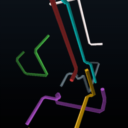
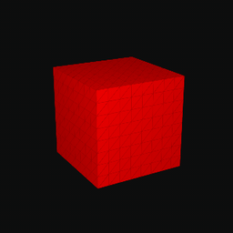
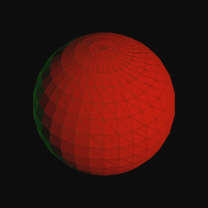

# cssGraphics

cssGraphics packages animated and interactive 3D models as real HTML and CSS,
without a WebGL or canvas renderer. Powered by the
[PolyCSS](https://github.com/LayoutitStudio/polycss) engine.

<p align="center">
  
  
  
</p>

## Run locally

```sh
pnpm install
pnpm dev
```

## Adapters

### 3D Pipes

[`src/adapters/3dpipes`](src/adapters/3dpipes) is an original generative
PolyCSS scene inspired by XScreenSaver `pipes.c` and Windows 3D Pipes. It uses
prepared connected tube meshes, lighting, and playback with stable retained
DOM.

```sh
pnpm install
pnpm build:3dpipes:full
pnpm dev:3dpipes
```

### Flower Box

[`src/adapters/flowerbox`](src/adapters/flowerbox) is an independent PolyCSS
reconstruction of the classic Flower Box. Its rounded prepared cycle uses
1,200 stable retained triangle leaves, prepared Morph transforms, and a
hash-bound q60 space-texel lighting atlas.

```sh
pnpm prepare:flowerbox:artifact
pnpm build:flowerbox
pnpm dev:flowerbox
```

Microsoft source, binaries, captures, and oracle packets are not included.

### Gears

[`src/adapters/gears`](src/adapters/gears) is a source-backed PolyCSS port of
XScreenSaver Gears. Twenty-four prepared three-gear assemblies enter from
distinct non-crossing viewport edges, lock, rotate for 15 seconds, and leave
before a shuffled, non-repeating prepared assembly takes over. The browser
retains three gear roots and does not build geometry, lighting, ratios, phase,
camera state, or DOM at runtime. A prepared portrait profile is selected below
600px. Gzip-prepared scene and snapshot files load selected-first, then fill a
four-request cached background queue for seamless later transitions.

```sh
pnpm prepare:gears:artifact
pnpm build:gears
pnpm dev:gears
```

The pinned XScreenSaver checkout, native binaries, captures, and generated
browser assets are not committed.

### Menger

[`src/adapters/menger`](src/adapters/menger) is a source-backed PolyCSS port of
XScreenSaver Menger. Its fixed depth-3 slice preserves the seeded recursive
cell and face census, palette rows, rotator states, 30 ms cadence, and prepared
camera. Prepare time merges 18,048 source faces into 84 retained coplanar plane
bundles with exact source-face coverage, then byte-deduplicates prepared moving
lighting into one Q83 AVIF and an exact delta address schedule. Runtime retains
only camera/scene roots plus 84 direct `<b>` leaves, publishes transforms every
30 ms and held lighting every 60 ms, and performs no geometry, recursion,
merging, lighting, address comparison, rotation, camera, or DOM construction.

```sh
pnpm prepare:menger:artifact
pnpm build:menger
pnpm dev:menger
```

### Maze

[`src/adapters/maze`](src/adapters/maze) is a source-backed PolyCSS port of
XScreenSaver Maze3D. Preparation selects 24 low-rotation seeded
mazes and emits gzip-bound retained snapshots. The browser loads one prepared
maze at a time and publishes prepared camera, wall-height, and visibility-delta
rows over 171 stable polygon leaves; it performs no maze generation, route
solving, geometry construction, camera math, visibility calculation, or DOM
growth.
The common surface and wall atlas pages are distributed once across all 24
snapshots.

```sh
pnpm prepare:maze:artifact
pnpm build:maze
pnpm dev:maze
```

The prepared product archive is hash-bound and includes the three pinned
XScreenSaver textures under the upstream copyright and permission notice.
The source checkout, native helpers, captures, and traces remain local and
ignored.

### ElectroPaint

[`src/adapters/electropaint`](src/adapters/electropaint) is a source-backed
PolyCSS preparation of the Kent/Ralph ElectroPaint motion model. It emits four
visually separated, warm-started 64,000-state seed banks over 40 stable retained
CSS quad roots at the source 60 Hz cadence. Each refresh selects one bank once
with browser cryptographic randomness and fetches only that bank. Each 17:46.7
timeline is split into 128 content-addressed binary gzip chunks with four parsed
and decoded ahead. Preparation resolves the random walk, history ring, matrices,
and colors. Runtime publishes 40 prepared
transform assignments and at most one prepared color-class assignment per
ordinary state, with no leaf scan, comparison, random generation, geometry,
matrix, color, camera, or cadence calculation. Inner chunk boundaries continue
the same prepared stream without a reset. Playback uses no CSS keyframes.

```sh
pnpm prepare:electropaint:source
pnpm build:electropaint
pnpm dev:electropaint
```

The three pinned authority checkouts are local and ignored. Source preparation
verifies their commits and bound file bytes; deployment reproduces the same
banks from that checked-in source lock. This adapter is
GPL-2.0-only. See the adapter's
[`NOTICE.md`](src/adapters/electropaint/NOTICE.md). It is not covered by the
repository's blanket MIT statement. The prepared source parameters and update
order are bound; native pixel parity is not yet claimed.

## License

The cssGraphics core and package are [MIT licensed](LICENSE). Scoped adapters
and third-party models retain their own terms and attribution. In particular,
the ElectroPaint adapter is not MIT licensed; see its local license and notice.
Catalog model attribution is listed in
[`site/public/catalog.json`](site/public/catalog.json).
