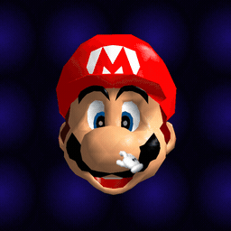

# cssGraphics

A DOM-ready 3D asset library powered by
[PolyCSS](https://github.com/LayoutitStudio/polycss).

Explore, animate, and reuse 3D assets made from real HTML and CSS, without canvas
or WebGL.

<p align="center">
  
  
  
</p>

## Run locally

Requires Node.js 22.12+ and pnpm 10.33.

```sh
pnpm install --frozen-lockfile
pnpm dev
```

Choose an asset, drag to rotate it, or press `/` to search.

```sh
pnpm typecheck
pnpm build
```

The repository also includes optional local Super Mario 64 preparation. It
requires a user-supplied ROM and does not distribute Nintendo game data.

## License

cssGraphics is [MIT licensed](LICENSE). Distributed assets retain the source and
license declared in [`site/public/catalog.json`](site/public/catalog.json).
